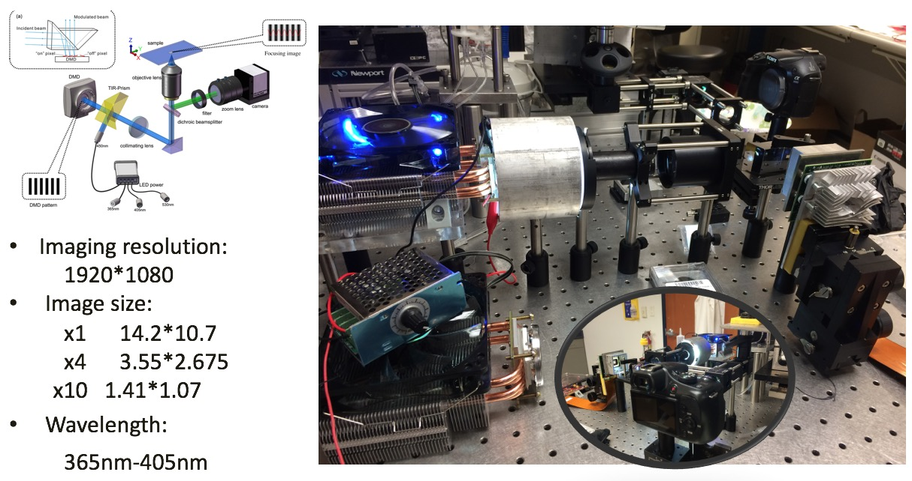
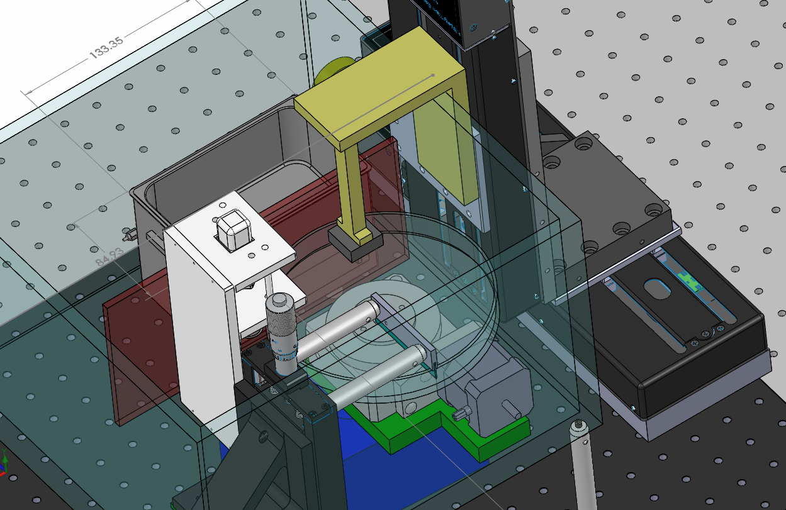
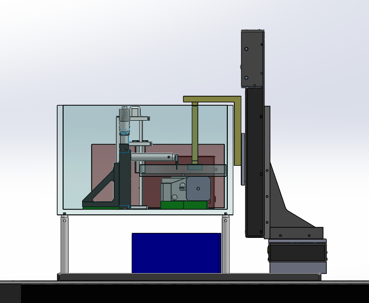
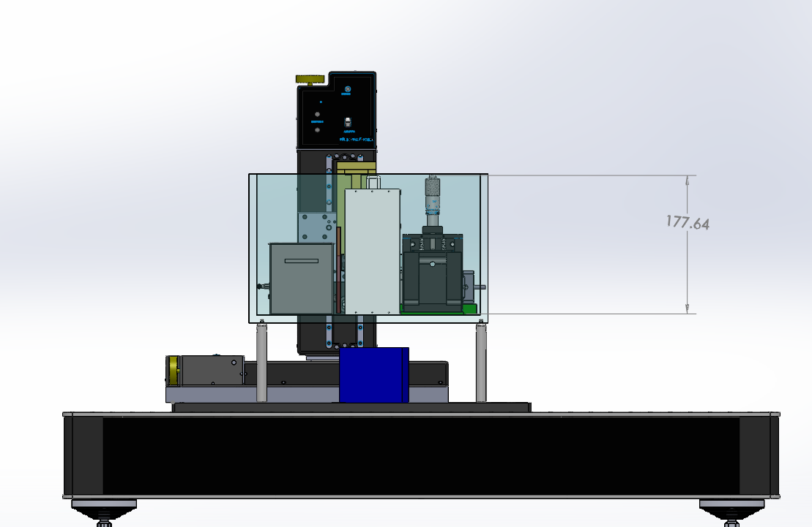

---
# try also 'default' to start simple
theme: seriph
# random image from a curated Unsplash collection by Anthony
# like them? see https://unsplash.com/collections/94734566/slidev
background: https://source.unsplash.com/collection/94734566/1920x1080
# apply any windi css classes to the current slide
class: 'text-center'
# https://sli.dev/custom/highlighters.html
highlighter: shiki
# some information about the slides, markdown enabled
info: |
  ## Slidev Starter Template
  Presentation slides for developers.

  Learn more at [Sli.dev](https://sli.dev)
---

# Benson's Portfolio

Past Designs&Builds 

---

# Multi-Material MIP-SLA 3D Printer

I designed, prototyped and fabricated the optical and material feeding system of this multi-material printer. An 100W industrial UV light LED was utilized to provide a collimated light beam that passes through a DMD device to form images. 

---

The Printing Plate was composed of a sealed cylinder with multiple inlets and outlets driven by a peristaltic pump to achieve material switch.

---

# Temperature controlled DLP Printer for Temporary Crown

I designed and built the material feeding and temperature control system to upgrade this printer for dental application. This device was specially designed for viscous materials such as temporary dental polymers. 

---

A scraping blade with a fine-turning linear stage was employed to create 75 μm layers for printing. 

A PID controlled infrared heating system was utilized to keep the temperature in 70-80 ℃.

---

# DLP Printer Modeling and Rendering

A showcase of a micron-level DLP printer model I drew with Solidworks and Rendered with Keyshot. The extra precise z direction linear stage was able to support printing layers in μm level. 

---

# MRI Helmet 3D Modeling with Hexagon Pattern on Irregular Surfaces

This is a model drawn with Solidworks for 3D printing a special helmet with hexagon pattern. Those patterns are designed for mounting coils that improve MRI image quality. 